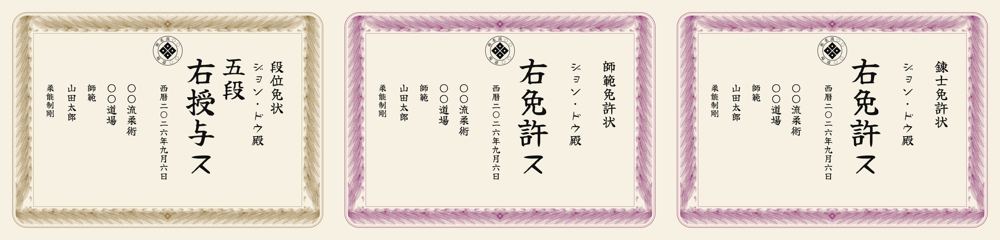

# menkyo-menjo-builder — Japanese dan and menkyo certificates

> [!NOTE]
> **Vibe coding warning.** Every line of code and documentation in this
> repository was generated by an AI model, with a human directing it and
> deciding what to keep. Read it as such: the code is workmanlike at best,
> the prose is more confident than the engineering behind it deserves, and
> nobody has reviewed it the way a maintained project would be reviewed.
>
> The certificates it produces, on the other hand, are real. They were
> designed carefully, checked against Japanese practice, and are printed and
> issued by an actual dōjō. If you are here for the documents rather than the
> software, that is the part to trust.

Generates print-ready dan-grade certificates (段位免状) and teaching licences
(免許状) for a martial-arts dōjō: A3 landscape, vertical Japanese, in the
manner of a traditional 賞状. The grade, the recipient and the date can each
be printed or left blank for a calligrapher to brush in.

<p align="center"></p>

<p align="center"><em>The three documents as an unconfigured build produces them.</em></p>

Everything that identifies a school lives in a TOML file. Out of the box the
generator names nobody: it prints 〇〇流柔術 and 〇〇道場 — the ordinary
Japanese placeholder — so an unconfigured build produces a correctly typeset
certificate that grants nothing.

## Quick start

```
pip install -r requirements.txt      # plus inkscape and ghostscript
python3 src/build_diploma.py --list  # what a default build would write
python3 src/build_diploma.py         # write it
```

Needs Python 3.11+ (for `tomllib`), Inkscape, Ghostscript, and Pillow / NumPy
/ SciPy. Files land in `build/` as `<award>-<variant>.<ext>`.

## Configuring it for your dōjō

Copy the example and edit it:

```
cp config/example.toml dojo.toml
```

`dojo.toml` in the repository root is picked up automatically and is
git-ignored, so your school's identity never lands in a fork. `--config PATH`
chooses between several.

```toml
[art]
name = "〇〇流柔術"          # the art, printed and on the crest's upper arc

[dojo]
name = "〇〇道場"            # the dōjō, printed below it
crest_ring = ""              # four characters on the crest's lower arc

[signer]
title = "師範"               # the office that grants the award
name = ""                    # the signatory, in katakana

[motto]
text = ""                    # an optional school precept, in its own column

[paper]
border = 22.0                # mm — see "Printing onto bought stock"
safe_inset = 38.0
text_drop = 0.05              # fraction of page height — see "Where the columns start"

[[awards]]
slug = "dan"
heading = "段位免状"         # names the document
formula = "右授与ス"         # "the above is hereby awarded"
grade_column = true          # the body also states a grade: 初段, 二段 …
colour = "#8a6a33"           # the drawn border
```

Each `[[awards]]` block becomes one `--awards` slug, so a school with a
different set of documents adds, removes or renames them here and nowhere
else. `grade_column` is the one subtle key: a dan certificate states a grade
in the body as well as in the heading, whereas a licence has already named
its award in the heading and would otherwise leave an empty column behind the
recipient's name. Setting it `false` closes the layout up.

Giving the licences a second `colour` is a good way to make them read apart
from the grades at a glance — but only on the `full` variants, since the
overlay route's border is bought paper.

### Where the columns start

`text_drop` shifts every printed column's starting point down by that
fraction of the page height, giving the reading order more air above it
without resizing or re-tuning anything. `0.05` is the shipped taste; `0`
reproduces the original layout, columns starting right under the crest.

It moves every column by the same amount, so a large value can push a tall
column past `safe_inset`. The one that matters is the date **left blank**:
its fourteen slots are the tallest column on the sheet, and at `0.05` it
still clears `safe_inset` by a few mm. Check with
`python3 src/build_diploma.py -v proof -d ''` before raising it further.

### An optional traced crest

The crest ring is set in a font by default, which is fine at 5 mm. If you have
your own crest and want its actual lettering, potrace each character to SVG,
drop them in `crest/` named `安.svg`, `心.svg` and so on, and set
`traced_glyphs = true` under `[dojo]`.

Compare the two before you commit to it. Display lettering is usually drawn
already distorted to fit its arc, and tracing it puts a second arc on top of
the first — which is why this is off by default. `crest/` is git-ignored for
the same reason `dojo.toml` is.

The default mon is the yotsume-bishi, a traditional kamon; its proportions are
constants at the top of `src/build_diploma.py`.

## Options

| flag | meaning |
|---|---|
| `-c`, `--config PATH` | which configuration to use (default: `dojo.toml`, else `config/example.toml`) |
| `-a`, `--awards LIST` | which awards, or `all` (default: all) |
| `-v`, `--variants LIST` | which variants, or `all` (default: `overlay,full-cream`) |
| `-f`, `--formats LIST` | `pdf`, `png`, `svg` (default: `pdf`) |
| `--press` | also write the colour conversions a commercial printer wants |
| `--no-ink` | solid black instead of graded sumi |
| `-n`, `--name KATAKANA` | print the recipient's name instead of leaving it blank |
| `-r`, `--rank GRADE` | print the grade: `2` or `nidan` → 二段, `1` → 初段, or literal text |
| `-d`, `--date YYYY-MM-DD` | print the award date in kanji; `today` also works |
| `--honorific TEXT` | appended to a printed name (default from the config; `''` to omit) |
| `--suffix TEXT` | tag for output filenames (defaults to the name) |
| `--dpi N` | resolution for PNG output (default: 300) |
| `--supersample N` | render the sumi text at N× and average down (1–4, default 1) |
| `--all` | shorthand for `--awards all --variants all` |
| `--clean` | empty `build/` first |
| `--list` | list what would be written, then stop |

```
python3 src/build_diploma.py -a dan -r 5 -n 'ヤン・ヤンセン' -d 2024-07-01
python3 src/build_diploma.py -a dan -v proof -f png      # one proof sheet
python3 src/build_diploma.py -v full --press             # for the print shop
```

## Variants

| variant | what it is |
|---|---|
| `overlay` | text only, to print onto bought Japanese 賞状用紙 — **the print asset** |
| `full-cream` | the drawn border plus the paper tint — **the one to look at on screen** |
| `full` | the drawn border, no printed tint, for real cream stock |
| `overlay-flat` | solid black instead of graded sumi, pure vector |
| `full-flat` | likewise, with the border |
| `proof` | safe areas and the zones the calligrapher fills |

Only `overlay` and `full-cream` are built by default: enough to print and
enough to look at, without burying them under variants you rarely want.

## Filling the document in

Three slots are normally left for the calligrapher — the grade, the recipient
and the date — and any of them can be printed instead.

`--rank` takes a number or romaji and writes the kanji: `2` or `nidan` becomes
二段, and `1` becomes **初段** — first dan has its own word, never 一段. Plain
numerals are used rather than the formal 弐段; pass the literal text if you
want the formal forms (`--rank 弐段`). Anything that is not a dan grade passes
through untouched, so a licence can use the same flag: `--rank 師範`.

`--date` takes an ISO date, or `today`, and writes 西暦二〇二六年九月五日: the
year digit by digit as 西暦 requires, month and day as spoken numbers (十二月,
三十一日). Leave it off and the column keeps an empty grid to brush into —
worth considering, since a sheet with the date already on it is one you cannot
hold back if a grading slips.

`--name` prints the recipient in katakana, in its own column between the
heading and the award, and moves the brushed rank slot left to make room. The
filename picks the name up so one recipient's files never overwrite another's.
Long names shrink to fit.

**How a Western name should be written in katakana is a judgement call.**
Dutch *Geert* could be ヘールト, ゲールト or フェールト — the hard G has no
Japanese equivalent and every choice is a compromise. Agree it with the
recipient before printing: it is the one word on the sheet they will look at
hardest.

## Printing — overlay onto bought stock

1. Buy blank A3 **横型** (landscape) 賞状用紙. Much of what is sold is portrait
   and the border will not rotate. Measure the width of its printed border.
2. Set `border` and `safe_inset` under `[paper]` to match. **The shipped values
   (22 mm / 38 mm) are placeholders** — nothing may print inside the band.
3. Print `<award>-overlay.pdf` at **100 %** — no "fit to page", no scaling. The
   page is exactly 420 × 297 mm; check with a ruler on the first sheet.
4. Run one plain sheet first and hold it against the stock at a window to check
   registration.

## Printing — the drawn border

1. `--variants full` on cream uncoated stock, 200–250 gsm. It has no printed
   background, so the paper supplies the colour — always better than
   `full-cream`, which prints the tint and is only for white stock.
2. For a commercial printer add `--press` and send the `-CMYK` file. Do **not**
   send the `-K` greyscale route: it would throw the border's colour away.
3. Test on the real printer first. The border's strokes are 0.11–0.22 mm. A
   laser at 600 dpi holds them; an inkjet on absorbent stock may thicken them
   and darken the band. If so, raise `density` in `src/border.py` — wider
   spacing — rather than thinning the strokes.

**Print a `-flat` variant alongside your first real print.** The graded text is
a greyscale raster; a home laser halftones grey, and some commercial RIPs
mishandle its transparency. If the 12 mm columns come out mottled, the `-flat`
files are the same layout in solid black, pure vector. Nothing else differs.

## How it looks the way it does

The printed text is set in **Yuji Boku** (佑字 木), a genuinely brush-written
kaisho, then graded by `src/ink.py` so the ink thins toward grey where the
brush lifts — a real brush never lays down flat black. The font ships in
`fonts/` and the build points fontconfig at it, so nothing needs installing and
nothing on your machine changes.

`src/border.py` draws the engraved border generatively: phoenix plumes with
herringbone barbs, clipped to an annulus, one half generated and mirrored.

`DECISIONS.md` records why each line reads as it does, and how the border and
the ink were arrived at.

## Layout

```
src/build_diploma.py    generator and CLI; typography constants at the top
src/config.py           the TOML configuration
src/border.py           the engraved phoenix-plume border
src/ink.py              the sumi grading
config/example.toml     placeholder configuration, the shipped default
fonts/                  Yuji Boku + its OFL licence, used without installing
docs/                   templates explaining each document to the person
                        who receives it, plus the image above
build/                  generated; git-ignored
```

## Writing for the recipient

A certificate in a language its recipient cannot read is worth accompanying
with a page that says what it says. [`docs/`](docs/) holds one such page per
document, written for exactly that reader.

They explain in full everything the generator prints on its own — the
headings, the award and licence formulas, the date, 殿, the reading order, the
default crest. The four things that are configuration are described only as
far as the form goes, each marked with a block beginning **"If you are
adapting this document"**. Replace those with your own account: what your
crest means, what your school's name means, who signs. Nobody else can write
that part.

## A note on what this makes

This produces credentials. It is a typesetting tool and it will cheerfully set
any school's name in any grade — the placeholders exist so that it does not do
so by default, but they are placeholders and not a lock.

Awarding rank in a Japanese martial art is somebody's prerogative, and usually
not the prerogative of whoever has a printer. Configure it for the documents
you are actually entitled to issue.

## Licence

MIT — see [LICENSE](LICENSE). Two things are not covered by it: the bundled
font, which is under the SIL Open Font License, and crests and school names,
which are nobody's to grant. See [NOTICE](NOTICE).
